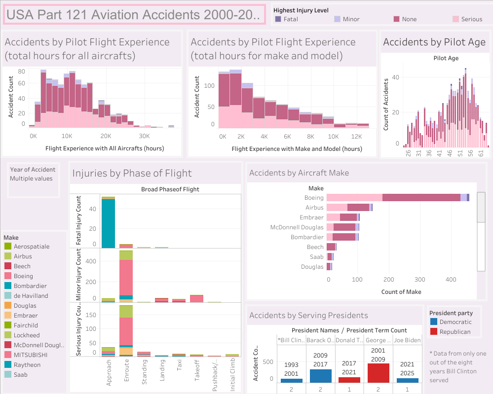

# USA Aviation Accident Data Analysis

## Project Overview

This project performs an in-depth analysis of USA aviation accidents from January 1, 2000, to the present day. While many public aviation accident datasets exist, this analysis focuses on previously unexplored factors by extracting information directly from the official NTSB (National Transportation Safety Board) accident reports. The primary goal was to answer questions related to pilot demographics, flight phase, and historical context, which are not readily available in the NTSB's queryable database.

## Key Questions & Hypotheses

The analysis was designed to explore the following factors:

* **Pilot Demographics:** What is the age and flight experience of pilots involved in accidents?

* **Historical Context:** Is there a correlation between the number of accidents and the U.S. presidential administration at the time?

* **Accident Phase:** At what point during the flight do most accidents occur?

## Data Sources & Methodology

The data for this project was compiled from two primary sources:

1. **NTSB Aviation Accident Data:** The initial dataset was sourced from the NTSB's public data query tool. A key step involved filtering for accidents with a "Complete" status and located in the United States, ensuring that final reports were available for analysis.

2. **NTSB Accident Report PDFs:** A custom Python script was developed to programmatically access and parse the final accident report PDFs. This was necessary to extract specific, granular details—such as pilot age and flight phase—that were not included in the main NTSB dataset.

3. **U.S. President Data:** A separate table containing a list of U.S. presidents and their terms was used to join with the accident data, enabling historical comparisons.

The raw data was cleaned and pre-processed using Microsoft Excel. The NTSB data and the U.S. president table were then joined using SQL in Google BigQuery to create a unified dataset. A significant challenge was the fact that more than half of the operator data was missing. This was identified and a Python script was used to parse the NTSB accident reports to find and add the missing operator information, greatly improving the completeness of the dataset.

## Dashboard
[Interactive Tableau Dashboard](https://public.tableau.com/shared/B3625B7GD?:display_count=n&:origin=viz_share_link)

## Key Findings

This analysis revealed several interesting insights, with more detailed findings available in the final Tableau dashboards:

* **Pilot Age:** Approximately **44%** of the accident reports analyzed involved pilots in the 47-57 age range. This aligns with broader industry data indicating that a significant portion of the pilot population falls within this demographic.

* **Geographical Hotspots:** The states with the highest number of aviation accidents were California, Illinois, Florida, Texas, Colorado, New York, and Alaska.

* **Alaska's Exception:** The high number of accidents in Alaska, disproportionate to its population, is primarily attributed to harsh weather conditions and rough terrain, which present unique challenges to aviation in the state.

* **Pilot Flight Experience:** The highest number of incidents occurred within the pilot experience range of 11,173 to 13,035 hours with all aircrafts. Moreover, for experience on the specific aircraft make and model, the highest percentage of accidents occurred with pilots who had between 0 and 1,175 hours.

## Tools & Technologies

The project utilized a combination of programming languages, libraries, and software for data extraction, analysis, and visualization.

* **Programming Language:** Python

* **Notebook Environment:** Google Colab

* **Data Extraction & Processing Libraries:** `pypdf`, `requests`, `pandas`, `re`

* **Cloud & Database Services:** Google BigQuery, Google Colab

* **Data Visualization:** Tableau

## Future Expansion
To provide a more comprehensive and contextual analysis, a future expansion of this project could focus on normalizing the accident data. This would involve accounting for the total number of flights and the size of each operator's fleet to calculate accident rates rather than just raw accident numbers.

* **Plane Manufacturer Data**: I would seek to find reliable data on the number of planes each top manufacturer (e.g., Boeing, Airbus) has provided to American companies. This would allow me to normalize the accident count by the number of aircraft in service, providing more accurate context on a per-plane basis. Sources like the FAA's data system or specialized commercial databases could be explored.

* **Operator Flight Data**: I would also aim to obtain the total number of flights performed by each airline or operator over the years. This data is often available from public sources like the Bureau of Transportation Statistics (BTS). By combining this data with the NTSB accident reports, I could calculate an accident rate per flight, which is a more standard and meaningful safety metric.
